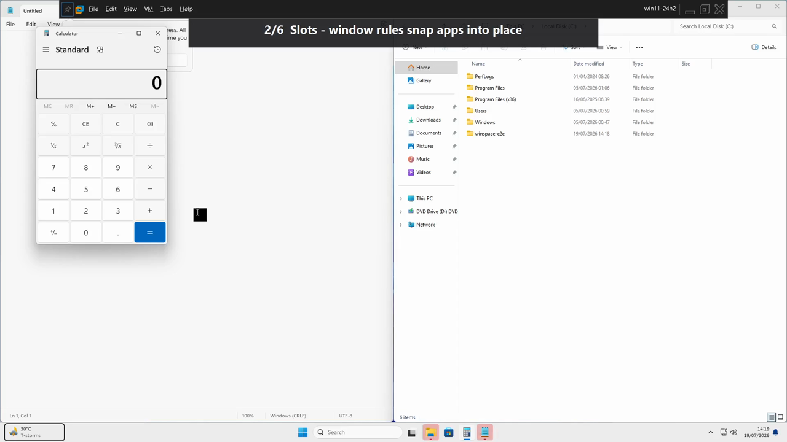

# winspace

A Windows 11 **workspace + focus manager** that leans on OS-native facilities and stays off
the input critical path. It switches Workspaces (real OS Virtual Desktops), steers keyboard
focus between windows by direction, and **auto-places every eligible window** — no tiling
daemon, no window geometry polling, no background CPU.

- **Windowless** — runs as a background process, no taskbar or tray window.
- **Hyprland-style config** — a plain-text `bind` / `windowrule` / `exec` grammar.
- **OS-native** — Workspaces *are* Virtual Desktops; focus and placement use Win32 directly.
- **Off the critical path** — window geometry is written **once** on a window's appearance
  (or an explicit rebalance), never continuously.

## Demo

A 60-second tour: auto-placement, slot rules, directional focus, workspace switching,
move-to-workspace, and on-demand rebalance.

[](docs/winspace-demo.mp4)

> ▶ **[docs/winspace-demo.mp4](docs/winspace-demo.mp4)** (GitHub opens it in the browser player.)

What the reel shows, in order:

1. **Distribute** — a new window is placed and maximized automatically.
2. **Slots** — `windowrule`s snap apps into place (Notepad → left half, Explorer → right half).
3. **Spatial focus** — `Alt+H` / `Alt+L` move the keyboard focus by direction.
4. **Workspaces** — `Alt+1..5` switch Virtual Desktops.
5. **Move to workspace** — `Alt+Shift+2` sends the focused window to another workspace.
6. **Tile** — rebalance every window on the current workspace on demand.

## Install

winspace ships as a self-bucketed [Scoop](https://scoop.sh) package:

```powershell
scoop bucket add winspace https://github.com/ptquang2000/winspace
scoop install winspace/winspace
```

Installing does **not** start winspace or enable autostart. Start it whenever you like:

```powershell
winspace
```

The Release binary links the CRT statically, so no VC++ redistributable is needed.

## Configuration

On first run winspace seeds a config at `%USERPROFILE%\.config\winspace\winspace.conf`
(it survives updates and uninstalls). Edit it and press your `reload` bind — hotkeys, window
rules, and launch entries all re-apply with no restart. A file with any error is rejected
**whole** and the last good config keeps running, so a typo never breaks your setup.

### Default keybindings

The default modifier is **`Alt`** (`$mod = ALT`), which registers on a stock Windows 11 with
no registry policy — unlike `Win`, which the shell reserves. The tradeoff is that these global
`Alt` chords shadow the focused app's own `Alt+<key>` shortcuts while winspace runs; rebind
freely if that bites.

| Keys | Action |
|------|--------|
| `Alt+1` … `Alt+5` | Switch to workspace 1–5 |
| `Alt+Shift+1` … `Alt+Shift+5` | Send the focused window to workspace 1–5 (stay put) |
| `Alt+H` / `Alt+J` / `Alt+K` / `Alt+L` | Move focus left / down / up / right |
| `Alt+Shift+R` | Reload the config |
| `Alt+Shift+Q` | Quit winspace |
| *(automatic)* | Every new eligible window is placed on the least-occupied display and maximized |

The `tile` dispatcher (re-balance all windows on the current workspace) isn't bound by
default — add `bind = $mod, T, tile` if you want it.

### Window rules

A `windowrule` pins a matching app to a workspace, optionally into a **slot** (a symbolic
fraction of the display work area), or excludes it from directional focus:

```ini
# Match by exe (case-insensitive, exact), class, or title (regex).
windowrule = workspace 2, exe:firefox.exe                 # pin Firefox to workspace 2
windowrule = workspace 1 slot left-half, exe:code.exe     # VS Code -> left half of workspace 1
windowrule = workspace 1 slot right-half, exe:explorer.exe
windowrule = ignore, class:Shell_TrayWnd                  # never a focus target; never moved
```

Slot vocabulary: `left-half`, `right-half`, `top-half`, `bottom-half`, the four `…-quarter`s,
and `maximized`. A matched window is opted **out** of automatic placement; unmatched windows
are auto-distributed.

### Launching apps

```ini
exec-once = firefox                         # run once at startup
exec      = "C:\path with spaces\app.exe"   # run at startup and on every reload
```

The launcher only *starts* apps; to place one, pair it with a `windowrule` matching its `exe`.

### Start at login

```ini
start_at_login = true
```

Then run `winspace install` once. This registers a per-user Task Scheduler logon task; the
config flag is the single source of truth (installing never enables autostart on its own).

## Building from source

```powershell
.\build.ps1 -Config release      # -> build\release\winspace.exe
```

## How it works

winspace is built around a pure `reduce(state, event) → (state, effects)` core that holds all
behavioral logic and performs no I/O; a thin Win32 adapter turns keystrokes and window events
into Events and executes the emitted Effects. The design language and every decision are
documented:

- **[CONTEXT.md](CONTEXT.md)** — the glossary / ubiquitous language shared by the code and ADRs.
- **[docs/adr/](docs/adr/)** — architecture decision records (Virtual Desktops, focus
  resolution, window rules, distribution, autostart, packaging, …).

## Testing

The pure core is unit-tested with zero dependencies; the I/O layer is exercised by a VM
seam-test harness that drives the real Release binary in a throwaway Windows 11 guest and
asserts against independent OS state. See
[scripts/PROVISIONING.md](scripts/PROVISIONING.md) and
[ADR-0005](docs/adr/0005-vm-seam-test-harness.md).

```powershell
.\scripts\Invoke-SmokeSeams.ps1            # run the full seam suite in the VM
```

The demo reel above is produced by a sibling driver,
[scripts/guest/Invoke-Demo.ps1](scripts/guest/Invoke-Demo.ps1).

## License

[Unlicense](LICENSE) — public domain.
